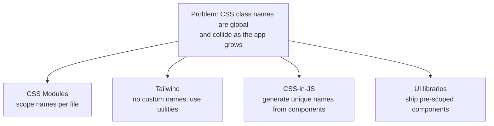

# 01 - Styling in React

React renders HTML, so everything you know about CSS still applies. What changes
is *where the styles live* and *how you keep them from stepping on each other*
as the app grows. This doc is the map; the next docs are the individual roads.

## The ways to style, from plain to powerful

### 1. Inline styles

JSX takes a `style` prop, but as a **JavaScript object** (camelCased
properties), not a CSS string:

```jsx
<p style={{ color: 'crimson', fontSize: '1.25rem' }}>Hi</p>
```

Fine for a one-off dynamic value. Bad as your main approach: no media queries,
no `:hover`, no reuse, and it clutters your markup. Use sparingly.

### 2. A plain CSS file

Import a `.css` file and use `className`:

```jsx
import './Button.css'
function Button() { return <button className="btn">Go</button> }
```

```css
/* Button.css */
.btn { padding: 0.5rem 1rem; border-radius: 8px; }
```

This works, and for a tiny app it is enough. The problem is **global scope**:
every class name you write goes into one global namespace shared by the whole
app.

## The core problem: global scope

CSS class names are global. If two files both define `.card`, the last one
loaded wins, everywhere. In a big app with many people, name clashes and
accidental overrides become a constant, hard-to-debug source of bugs.

```css
/* Profile.css */        /* Product.css */
.card { background: white } .card { background: navy }   /* which one wins? */
```

Every modern styling approach is, at heart, an answer to *this* problem:



| Approach | How it avoids clashes | Doc |
| --- | --- | --- |
| **CSS Modules** | compiler renames classes to be unique per file | [02](02-css-modules.md) |
| **Tailwind** | you stop naming things; you compose utility classes | [03](03-tailwind-css.md) |
| **styled-components** | styles are tied to a component, names auto-generated | [04](04-css-in-js-styled-components.md) |
| **UI libraries** | components arrive already styled and scoped | [06](06-ui-component-libraries.md) |

## What about responsive and layout?

Styling (colors, spacing, type) and **layout** (how boxes are arranged) are
related but separate. Whatever styling approach you pick, the *layout* tools are
the same CSS primitives: **Flexbox and Grid**, plus **media queries** for
responsiveness. That gets its own doc: [05](05-responsive-layout-flexbox-grid.md).

## How styling reaches the browser

With a build tool like Vite, importing CSS (or using Tailwind/CSS-in-JS) is
handled for you: Vite bundles the styles, scopes them where needed, and injects
them. You do not link stylesheets by hand in `index.html` the way you did in
plain HTML; you `import` them where they are used.

## In one breath, for the exam

> React renders HTML, so CSS still applies, but class names are **global** and
> collide as an app grows. Every modern approach solves that: **CSS Modules**
> scope names per file, **Tailwind** removes custom names via utility classes,
> **CSS-in-JS** generates unique names from components, and **UI libraries** ship
> pre-styled components. Layout is separate and uses Flexbox/Grid plus media
> queries regardless of which you choose.

## References

- React Documentation. *Adding Styles*. https://react.dev/learn/adding-styles
- MDN Web Docs. *CSS first steps*. https://developer.mozilla.org/en-US/docs/Learn_web_development/Core/Styling_basics
- Vite. *Features: CSS*. https://vite.dev/guide/features.html#css
