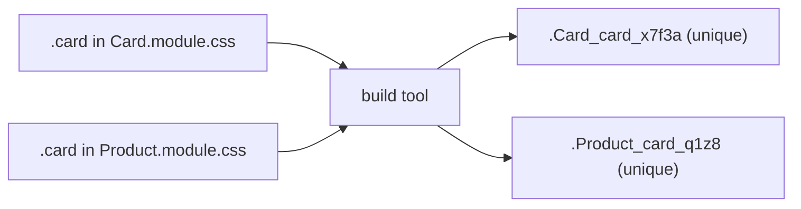

# 02 - CSS Modules

**CSS Modules** are the smallest possible step up from a plain CSS file: you
write normal CSS, but the build tool **scopes every class name to that file** so
it can never clash with another file's. No new language, no library.

## How it works

Name the file `Something.module.css`. Import it as an object and use the class
names as **properties**:

```css
/* Card.module.css */
.card { padding: 1rem; border-radius: 12px; background: white; }
.title { font-size: 1.25rem; font-weight: 600; }
```

```jsx
import styles from './Card.module.css'

export default function Card({ title }) {
  return (
    <article className={styles.card}>
      <h2 className={styles.title}>{title}</h2>
    </article>
  )
}
```

At build time, `styles.card` becomes a unique name like `Card_card_x7f3a`. Two
files can both define `.card` and they will never collide, because each compiles
to a different real name.



## Combining and conditional classes

`styles.x` is just a string, so combine with a template literal:

```jsx
<button className={`${styles.btn} ${isPrimary ? styles.primary : ''}`}>Go</button>
```

For anything beyond a couple of conditions, the tiny `clsx` library reads better:

```jsx
import clsx from 'clsx'
<button className={clsx(styles.btn, { [styles.primary]: isPrimary })} />
```

## Vite setup

With Vite, **there is no setup**. Any file ending in `.module.css` is treated as
a CSS Module automatically. That is the whole reason CSS Modules are a great
default for this course.

## Strengths and trade-offs

**Good:**
- It is just CSS. Everything you know transfers; no new syntax to learn.
- Scoping is automatic and reliable.
- Zero runtime cost: it all happens at build time.

**Trade-offs:**
- You still invent class names (just locally), and still switch between a `.jsx`
  and a `.css` file.
- Sharing design tokens (colors, spacing) across modules needs CSS variables or
  a shared file; it does not give you a design system on its own.

## When to choose it

A safe, low-friction default, especially if you already know CSS and want
scoping without learning a framework. Great for this course's projects.

## In one breath, for the exam

> CSS Modules let you write normal CSS in a `*.module.css` file; the build tool
> renames each class to be **unique per file**, so class names never clash. You
> import the file as an object and use `styles.className`. With Vite it needs no
> setup. It is the smallest step from plain CSS to safe, scoped styles.

## References

- Vite. *CSS Modules*. https://vite.dev/guide/features.html#css-modules
- css-modules. *Documentation*. https://github.com/css-modules/css-modules
- MDN Web Docs. *Using CSS custom properties*. https://developer.mozilla.org/en-US/docs/Web/CSS/Using_CSS_custom_properties
