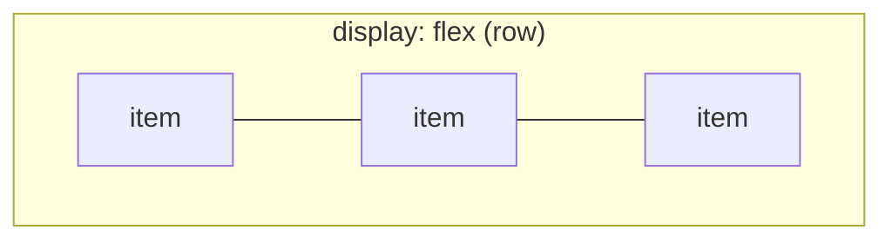
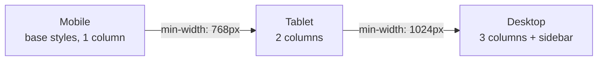

# 05 - Responsive layout: Flexbox and Grid

Styling is colors and type; **layout** is how boxes are arranged on the page.
Whatever styling approach you chose (CSS Modules, Tailwind, styled-components),
layout uses the same two CSS systems: **Flexbox** and **Grid**, made responsive
with **media queries**. This is the doc that makes Project 2 look right on every
screen.

The principles behind responsive and mobile-first design are in
[`react-theory/10-design-methodologies.md`](../react-theory/10-design-methodologies.md);
this doc is the hands-on CSS.

## Flexbox: arranging things in one direction

**Flexbox** lays out items in a single row or column and distributes space
between them. Reach for it for navbars, toolbars, button groups, centering.

```css
.nav {
  display: flex;
  justify-content: space-between; /* spread along the main axis (row) */
  align-items: center;            /* center on the cross axis */
  gap: 1rem;                       /* space between items */
}
```

The mental model: pick a **direction** (`flex-direction: row` or `column`), then
align along the **main axis** (`justify-content`) and the **cross axis**
(`align-items`).



## Grid: arranging things in two directions

**CSS Grid** lays out items in rows *and* columns at once. Reach for it for page
layouts and card galleries.

```css
.gallery {
  display: grid;
  grid-template-columns: repeat(3, 1fr); /* three equal columns */
  gap: 1rem;
}
```

A responsive gallery with no media query at all, using `auto-fill` and
`minmax` (columns are as wide as possible but at least 200px, wrapping as
needed):

```css
.gallery {
  display: grid;
  grid-template-columns: repeat(auto-fill, minmax(200px, 1fr));
  gap: 1rem;
}
```

**Rule of thumb:** Flexbox for one dimension (a row *or* a column), Grid for two
(rows *and* columns). They combine happily: a Grid page with Flexbox inside each
cell.

## Media queries: changing layout by screen size

A **media query** applies styles only when a condition (usually screen width) is
met. A **breakpoint** is the width where the layout changes.

```css
.layout { display: grid; grid-template-columns: 1fr; } /* phone: one column */

@media (min-width: 768px) {
  .layout { grid-template-columns: 240px 1fr; }        /* tablet+: sidebar + content */
}
```

## Mobile-first

Write the **base styles for the smallest screen**, then *add* with `min-width`
media queries as the screen grows. This forces you to prioritize, and adding is
easier than removing.



In Tailwind this is the unprefixed-then-`md:` pattern from
[03](03-tailwind-css.md); in CSS Modules or styled-components it is the
`@media (min-width: ...)` blocks above.

## A few must-haves for "responsive"

- **The viewport meta tag** (already in your `index.html`):
  `<meta name="viewport" content="width=device-width, initial-scale=1.0" />`.
  Without it, mobile browsers pretend to be desktop and your media queries do
  nothing.
- **Fluid units:** prefer `%`, `rem`, `fr`, `min()/max()/clamp()` over fixed
  pixels for things that should adapt.
- **No horizontal scroll on mobile:** images and wide elements need
  `max-width: 100%`. A page that scrolls sideways on a phone is the classic
  "not responsive" tell, and the autograder will check for it.

## In one breath, for the exam

> Layout uses **Flexbox** for one direction (rows or columns: navbars, centering)
> and **Grid** for two (page layouts, galleries). **Media queries** change styles
> at **breakpoints**, and you write them **mobile-first**: base styles for small
> screens, then `min-width` queries add complexity upward. The viewport meta tag
> and fluid units (%/rem/fr) make it actually adapt; no horizontal scroll on
> mobile.

## References

- MDN Web Docs. *Flexbox*. https://developer.mozilla.org/en-US/docs/Web/CSS/CSS_flexible_box_layout/Basic_concepts_of_flexbox
- MDN Web Docs. *CSS Grid Layout*. https://developer.mozilla.org/en-US/docs/Web/CSS/CSS_grid_layout/Basic_concepts_of_grid_layout
- MDN Web Docs. *Using media queries*. https://developer.mozilla.org/en-US/docs/Web/CSS/CSS_media_queries/Using_media_queries
- Josh Comeau. *An Interactive Guide to Flexbox*. https://www.joshwcomeau.com/css/interactive-guide-to-flexbox/
