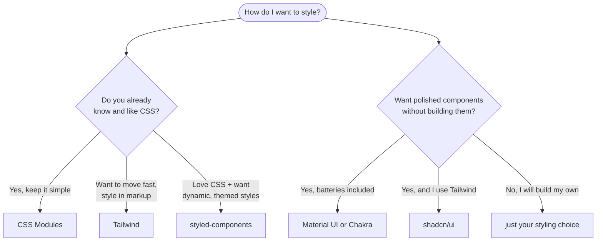

# 07 - Choosing your stack

You have seen four ways to style and three component libraries. For the projects
you must **pick**, and beginners freeze here. This doc is the decision guide. The
short version: there is no wrong choice for a course project, so choose, commit,
and ship.

## Two separate decisions

Do not confuse them:

1. **How do I write styles?** -> CSS Modules *or* Tailwind *or* styled-components.
   Pick **one**.
2. **Do I want pre-built components?** -> optionally add **one** UI library (MUI,
   Chakra, or shadcn/ui).

A UI library still needs a styling approach for *your own* bits, but it handles
most of it. shadcn/ui in particular assumes Tailwind.

## A decision guide

## Trade-offs at a glance

| Approach | Learn curve | Speed | Control | Best for |
| --- | --- | --- | --- | --- |
| **CSS Modules** | tiny (it is CSS) | medium | full | knowing CSS, wanting scope |
| **Tailwind** | medium (the classes) | fast | full | building fast, styling in markup |
| **styled-components** | medium | medium | full | dynamic, theme-driven styling |
| **MUI / Chakra** | medium (the API) | very fast | lower | polished UI in a hurry |
| **shadcn/ui** | medium (+ Tailwind) | fast | full (you own it) | Tailwind users wanting components |

## Honest recommendations for these projects

- **Want the smoothest path and already know CSS?** CSS Modules. No new
  concepts; just scoped CSS.
- **Want it to look impressive fast?** Tailwind, optionally with shadcn/ui for
  ready components.
- **Want the most polished UI with least design effort?** Chakra or MUI.
- **Curious about the CSS-in-JS style?** styled-components is a great way to
  learn it.

Any of these earns full marks if used well. **Graded on use, not on which one.**

## Rules that apply whatever you pick

- **Pick one styling approach and one UI library, maximum.** Mixing three is the
  fastest way to an inconsistent, bloated, hard-to-grade project.
- **Be consistent:** the same spacing scale, the same color set, the same button
  everywhere. Consistency *is* the design system
  ([`react-theory/09-design-systems.md`](../react-theory/09-design-systems.md)).
- **Responsive is non-negotiable** ([05](05-responsive-layout-flexbox-grid.md)),
  regardless of styling choice.
- **Accessibility still matters:** semantic elements, labels, contrast
  ([`react-theory/10-design-methodologies.md`](../react-theory/10-design-methodologies.md)).

## In one breath, for the exam

> Styling is **two decisions**: how you write styles (CSS Modules *or* Tailwind
> *or* styled-components, pick one) and whether to add **one** UI library (MUI,
> Chakra, or shadcn/ui). All are valid; choose by what you know and how fast you
> want to move, then **commit and stay consistent**. Responsive layout and
> accessibility are required no matter what you pick.

## References

- Josh Comeau. *CSS for JavaScript Developers* (overview). https://css-for-js.dev/
- React Documentation. *Adding Styles*. https://react.dev/learn/adding-styles
- See docs [02](02-css-modules.md) through [06](06-ui-component-libraries.md) for each option in depth.
