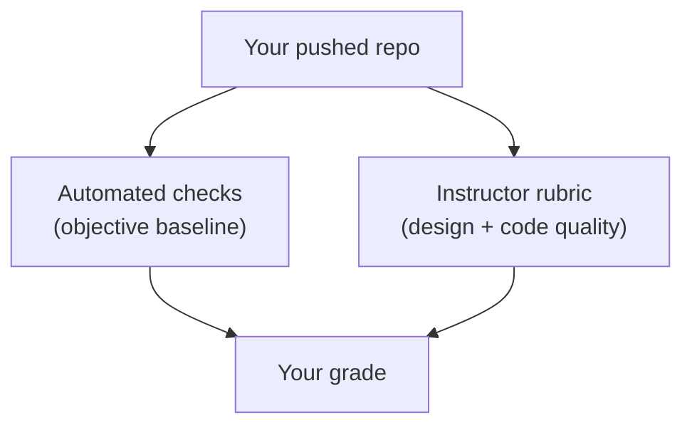

# Module 3 - How the projects are graded

These projects are open-ended: you choose your styling approach and UI library.
So your grade comes in two parts: **automated checks** that confirm the basics
work, and a **rubric** your instructor uses to judge the craft. The automated
part is the floor; the rubric is where a polished, thoughtful project pulls
ahead.

## Automated checks (the baseline)

Make sure all of these are true before you submit. You can check most of them
yourself by running `npm run build` and `npm test` locally.

| Check | What it means |
| --- | --- |
| **It builds** | `npm run build` finishes with no errors |
| **It runs** | the built app loads a page without crashing |
| **Real styling approach** | you used CSS Modules, Tailwind, styled-components, or a UI library, not just inline `style={{}}` everywhere |
| **Required behavior / structure** | the contract in your project brief works (Project 1: add / flip / delete flashcards; Project 2: the hero, About, Projects, and Contact landmarks exist) |
| **Responsive** | on a 375px-wide phone there is **no horizontal scrolling** |
| `student.json` | every field filled in |

Your repo also publishes **screenshots of your app at phone, tablet, and desktop
widths** on each push (linked from the Actions run). Use them to check your work
looks right at every size.

## The design rubric (the other 50 points)

Your instructor scores these from your running app, the published screenshots,
and your code. This is what separates a project that merely passes from a great
one. Each row is scored on a sliding scale; the levels below are the guide.

| Criterion | Max | Excellent (full marks) | Satisfactory (about 60-80%) | Needs work (about 0-40%) |
| --- | --- | --- | --- | --- |
| **Visual design & hierarchy** | 12 | clear focal points; intentional spacing, type, and color; polished | readable but plain or uneven | cluttered or unstyled |
| **Responsive quality** | 8 | adapts gracefully at every width with sensible breakpoints | works but awkward at some sizes | only "does not overflow" |
| **Consistency / design system** | 8 | one approach used well; reused components; a coherent look | mostly consistent, some drift | ad-hoc and inconsistent |
| **Accessibility** | 8 | semantic elements, labelled controls, good contrast, keyboard-usable | partially addressed | ignored |
| **Code organization** | 7 | sensible components and folders ([`react-theory/07`](../react-theory/07-project-structure-and-organization.md)), no dead code | okay structure | monolithic or messy |
| **Completeness / UX** | 7 | Project 1: the flashcards are pleasant to study; Project 2: the portfolio feels finished | mostly there | thin or unfinished |

**Design rubric total: 50 points.**

## How the 100 points split

| Part | Points |
| --- | --- |
| Builds and runs | 10 |
| Uses a real styling approach | 5 |
| Required behavior / structure (the contract) | 25 |
| Responsive (no horizontal scroll on mobile) | 10 |
| **Automated baseline subtotal** | **50** |
| Design rubric (the table above) | 50 |
| **Total** | **100** |

> The automated baseline guarantees a working, responsive app. The design rubric
> rewards craft. Aim past the floor: build something you would be proud to link
> on a CV. (Your instructor may adjust the exact weights, but this is the shape.)
