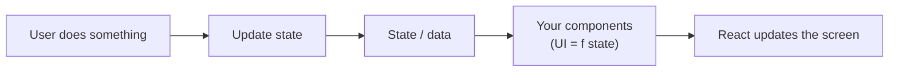
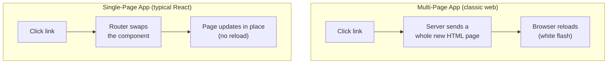

# 01 - What is React?

## The one-sentence answer

**React is a JavaScript library for building user interfaces out of
components.** You describe what the screen should look like for a given set of
data, and React keeps the actual screen in sync as that data changes.

That is the whole idea. Everything else (the Virtual DOM, hooks, JSX) exists to
make that one job fast and pleasant.

## Why React exists: the problem it solves

Before React, building an interactive page meant **manually changing the DOM**:
find an element, read its text, update it, add a class, remove a node. With
jQuery this looked like:

```js
$('#count').text(newCount)
if (newCount > 10) $('#warning').show()
```

This is **imperative**: you write step-by-step instructions for *how* to mutate
the page. In a small page it is fine. In a big app it becomes a nightmare,
because the same piece of data is reflected in many places, and you have to
remember to update every one of them by hand. Bugs creep in when the screen and
the data drift out of sync.

React's insight: **let the developer describe the result, not the steps.** You
write a function that says "given this data, the screen looks like *this*", and
React figures out the minimal DOM changes needed to get there.

## Declarative vs imperative

This is the single most important shift in mindset.

| | Imperative | Declarative |
| --- | --- | --- |
| You write | *how* to change the screen | *what* the screen should be |
| Example | "set the text to 5, then show the warning" | "the screen is `count` plus, if `count > 10`, a warning" |
| Who tracks updates | you | React |

```jsx
// Declarative: describe the UI as a function of state. React does the rest.
function Counter({ count }) {
  return (
    <>
      <span>{count}</span>
      {count > 10 && <p className="warning">That is a lot!</p>}
    </>
  )
}
```

You never write "now update the span". You change `count`, and React re-derives
the screen. **UI = f(state)** is the phrase to remember.

### Visualizing it



## Library, not framework

React is a **library**, not a **framework**, and the distinction matters.

- A **framework** (Angular, say) gives you an opinionated answer for everything:
  routing, forms, HTTP, state, structure. You build *inside* its rules.
- A **library** does one thing. React renders components. It deliberately leaves
  routing, data fetching, and global state to you (or to other libraries you
  pick). That is why Activity 5 installs React Router separately: it is not part
  of React.

This is freedom and responsibility at once. You assemble your own stack (see
[11-the-react-ecosystem.md](11-the-react-ecosystem.md)). Tools like **Next.js**
wrap React into something more framework-like.

## SPA vs MPA

- A **Multi-Page Application (MPA)** is the classic web: each link asks the
  server for a whole new HTML page, and the browser reloads. Simple, but every
  navigation is a full round trip and a white flash.
- A **Single-Page Application (SPA)** loads one HTML page and one JavaScript
  bundle, then *rewrites the page in place* as you navigate. React apps are
  usually SPAs. Navigation feels instant because nothing reloads; the router
  (Activity 5) just swaps which component renders.

The trade-off: SPAs can be slower on first load (you download the app up front)
and need extra care for SEO. Frameworks like Next.js blur the line by rendering
on the server too.

### MPA vs SPA at a glance



## What React is *not*

- Not a language (it is JavaScript).
- Not a full framework (no built-in router, HTTP client, or global store).
- Not only for websites: **React Native** uses the same component model to build
  native mobile apps.

## In one breath, for the exam

> React is a declarative JavaScript **library** for building UIs from
> **components**. You describe the UI as a function of state (`UI = f(state)`),
> and React efficiently updates the DOM to match. It is a library, not a
> framework, so you compose it with tools like React Router. React apps are
> typically single-page applications.

## References

- React Documentation. *Quick Start*. https://react.dev/learn
- React Documentation. *Thinking in React*. https://react.dev/learn/thinking-in-react
- React Documentation. *Reacting to Input with State*. https://react.dev/learn/reacting-to-input-with-state
- MDN Web Docs. *SPA (Single-page application)*. https://developer.mozilla.org/en-US/docs/Glossary/SPA
