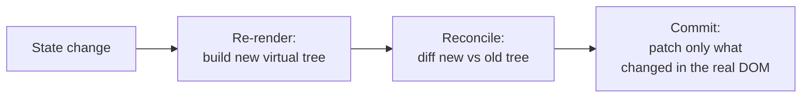

# 02 - The Virtual DOM and rendering

## The DOM, quickly

The **DOM** (Document Object Model) is the browser's live, in-memory tree of
your page: every element is a node. JavaScript changes the page by changing the
DOM. The catch: **DOM updates are expensive.** Touching the real DOM can force
the browser to recalculate layout and repaint, and doing it repeatedly (or in
the wrong order) makes apps janky.

## What the Virtual DOM is

The **Virtual DOM** is React's lightweight copy of the UI, kept as plain
JavaScript objects in memory. It is not a browser feature; it is React's own
data structure. A virtual node is just an object like:

```js
{ type: 'h1', props: { className: 'title' }, children: ['Hello'] }
```

Because it is plain objects, building and comparing it is cheap. The expensive
real DOM is touched only when necessary.

## Reconciliation: how an update works

When state changes, React does **not** wipe the page and rebuild it. It runs a
three-step cycle:

1. **Render.** React calls your component functions again and builds a *new*
   Virtual DOM tree describing what the UI should look like now.
2. **Diff (reconciliation).** It compares the new tree to the previous one and
   works out the **smallest set of real changes** needed. This comparison
   algorithm is called *reconciliation*.
3. **Commit.** React applies only those changes to the real DOM.

So if only one `<span>`'s text changed, only that text node is updated. The
other 500 nodes are left untouched.

```
state change  ->  re-render (new virtual tree)  ->  diff vs old tree  ->  patch real DOM
```

### The update cycle, visualized



## Why keys matter

When React diffs a **list**, it needs to know which new item corresponds to
which old item. That is what a **`key`** is for: a stable identity per item.

- With good keys (a real id), React knows "item 3 was removed" and patches
  exactly that.
- With no keys, or the array **index** as a key, React can mismatch items when
  the list reorders, leading to wrong content or lost input state.

```jsx
{todos.map(todo => <Todo key={todo.id} {...todo} />)}   // stable id, not index
```

This is the practical reason the lists section of Activity 3 insists on keys.

## Why "re-render" is not "reload"

A **re-render** means React *calls your component function again* to get a fresh
description. It does **not** mean the browser reloads the page or that the real
DOM is rebuilt. Most re-renders result in zero or tiny DOM changes after the
diff. Re-rendering is cheap by design; that is the point of the Virtual DOM.

A component re-renders when:

- its **state** changes (a setter was called), or
- its **parent** re-renders, or
- a **context** it consumes changes.

## A note on the modern engine (Fiber)

Since React 16, the reconciler is called **Fiber**. It can split rendering work
into chunks and pause/resume it, so a big update does not block the browser and
freeze the page. You do not interact with Fiber directly; it is why React stays
responsive under load. (You may also hear about the **React Compiler**, newer
tooling that auto-optimizes re-renders. The mental model above is unchanged.)

## Common misconceptions to correct

- *"The Virtual DOM is faster than the real DOM."* Not exactly. The real DOM is
  the slow part; the Virtual DOM lets React **avoid touching it** unless needed.
  The win is fewer, smaller real-DOM operations, plus a much nicer programming
  model.
- *"React re-renders the whole page on every change."* No. It re-runs component
  functions, diffs, and patches only what changed.

## In one breath, for the exam

> The Virtual DOM is React's in-memory tree of plain objects describing the UI.
> On a state change React re-renders to a new virtual tree, **reconciles** it
> against the old one to compute the minimal diff, and **commits** only those
> changes to the real DOM. Keys give list items a stable identity so the diff is
> correct. A re-render is a function call, not a page reload.

## References

- React Documentation. *Render and Commit*. https://react.dev/learn/render-and-commit
- React Documentation. *Preserving and Resetting State*. https://react.dev/learn/preserving-and-resetting-state
- React Documentation. *Rendering Lists: keeping items in order with key*. https://react.dev/learn/rendering-lists#keeping-list-items-in-order-with-key
- MDN Web Docs. *Introduction to the DOM*. https://developer.mozilla.org/en-US/docs/Web/API/Document_Object_Model/Introduction
- Andrew Clark. *React Fiber Architecture*. https://github.com/acdlite/react-fiber-architecture
