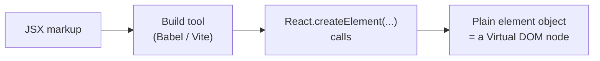
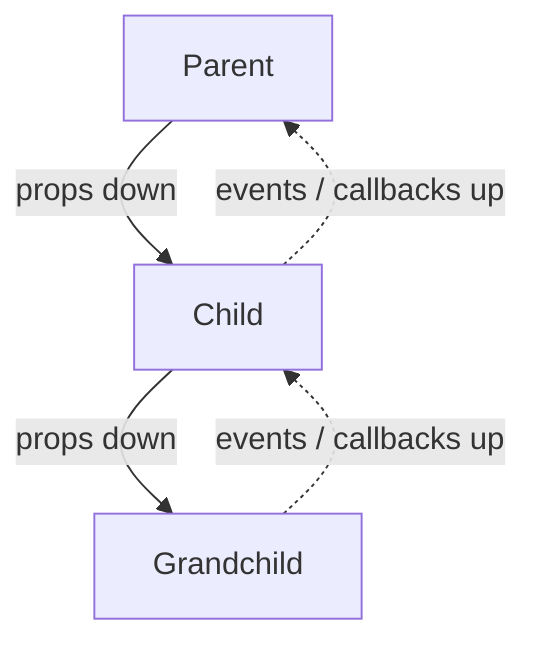

# 03 - JSX and the component model

## JSX is syntax sugar

**JSX** is the HTML-looking markup you write inside JavaScript. It feels like a
templating language, but it is not: it is **syntax sugar** that a build tool
(Babel/Vite) compiles into plain function calls. This:

```jsx
const ui = <h1 className="title">Hello, {name}</h1>
```

compiles to roughly this:

```js
const ui = React.createElement('h1', { className: 'title' }, 'Hello, ', name)
```

`createElement` returns a plain object: a **React element**, a node in the
Virtual DOM ([02](02-virtual-dom-and-rendering.md)). Understanding this explains
every "weird" JSX rule:

- **One root element.** A function returns one value, so JSX returns one element.
  Wrap siblings in a `<div>` or a fragment `<>...</>`.
- **`className`, not `class`.** The compiled object is JavaScript, and `class` is
  a reserved word. Likewise `htmlFor` instead of `for`.
- **`{ }` drops in JavaScript.** Anything inside braces is a real JS expression
  whose value becomes a child or an attribute. You can put `{name}`,
  `{a + b}`, `{items.map(...)}`; you cannot put statements like `if` or `for`.
- **Attributes are camelCase.** `onclick` becomes `onClick`, `tabindex` becomes
  `tabIndex`.

> JSX is optional. You *could* write `React.createElement` by hand. Nobody does,
> because JSX reads like the UI it produces. But knowing what it compiles to is
> what makes the rules stop feeling arbitrary.

### From JSX to a Virtual DOM node



## Components are functions

A **component** is a function that takes **props** (an object) and returns a
React element. By convention its name is **capitalized**, which is how React
tells `<Card />` (your component) apart from `<card />` (an unknown HTML tag).

```jsx
function Card({ title, children }) {
  return <article><h2>{title}</h2>{children}</article>
}
```

The same component, given the same props, returns the same UI. Think of a
component as a **pure function from props to UI** (plus state and effects, which
later docs cover). This purity is what lets React re-render freely.

## Composition over inheritance

In classic object-oriented design you reuse code with **inheritance**: a
`Button` class extends a `Control` class. React deliberately does **not** work
that way. You reuse UI by **composition**: small components nested inside bigger
ones, and content passed through.

The main tool is the **`children`** prop. Anything you put between a component's
tags arrives as `children`:

```jsx
function Panel({ children }) {
  return <div className="panel">{children}</div>
}

<Panel>
  <h2>Settings</h2>      {/* this whole block is `children` */}
  <Toggle />
</Panel>
```

Need a component to take *several* slots? Pass elements as props:

```jsx
<SplitPane left={<Sidebar />} right={<Content />} />
```

This is why the official guidance is **"composition over inheritance"**: you
build complex UI by *combining* simple components, not by subclassing them. See
[05-component-architecture.md](05-component-architecture.md) for how to draw the
boundaries between them.

## One-way data flow

Data in React flows in **one direction: down**. A parent passes props to a
child; the child reads them but cannot change them. Props are **read-only**.

```
Parent  --(props)-->  Child  --(props)-->  Grandchild
```

If a child needs to affect the parent, the parent passes down a **function** the
child can call (an event flowing back up). This is "data down, events up", and it
is the backbone of [lifting state up](05-component-architecture.md).



Why one-way? Because it makes apps **predictable**: to find why something on
screen looks the way it does, you trace data downward from where it lives. Two-way
binding (data flowing both directions automatically) is convenient at first but
makes large apps hard to reason about.

## In one breath, for the exam

> JSX is syntax sugar that compiles to `React.createElement` calls returning
> plain element objects, which is why its rules (one root, `className`, `{ }` for
> JS) exist. A component is a capitalized function from props to UI. React reuses
> UI by **composition** (nesting components and passing `children`), not
> inheritance, and data flows **one way**: props down, events (callbacks) up.

## References

- React Documentation. *Writing Markup with JSX*. https://react.dev/learn/writing-markup-with-jsx
- React Documentation. *JavaScript in JSX with Curly Braces*. https://react.dev/learn/javascript-in-jsx-with-curly-braces
- React Documentation. *Passing Props to a Component*. https://react.dev/learn/passing-props-to-a-component
- React Documentation. *createElement* (API reference). https://react.dev/reference/react/createElement
