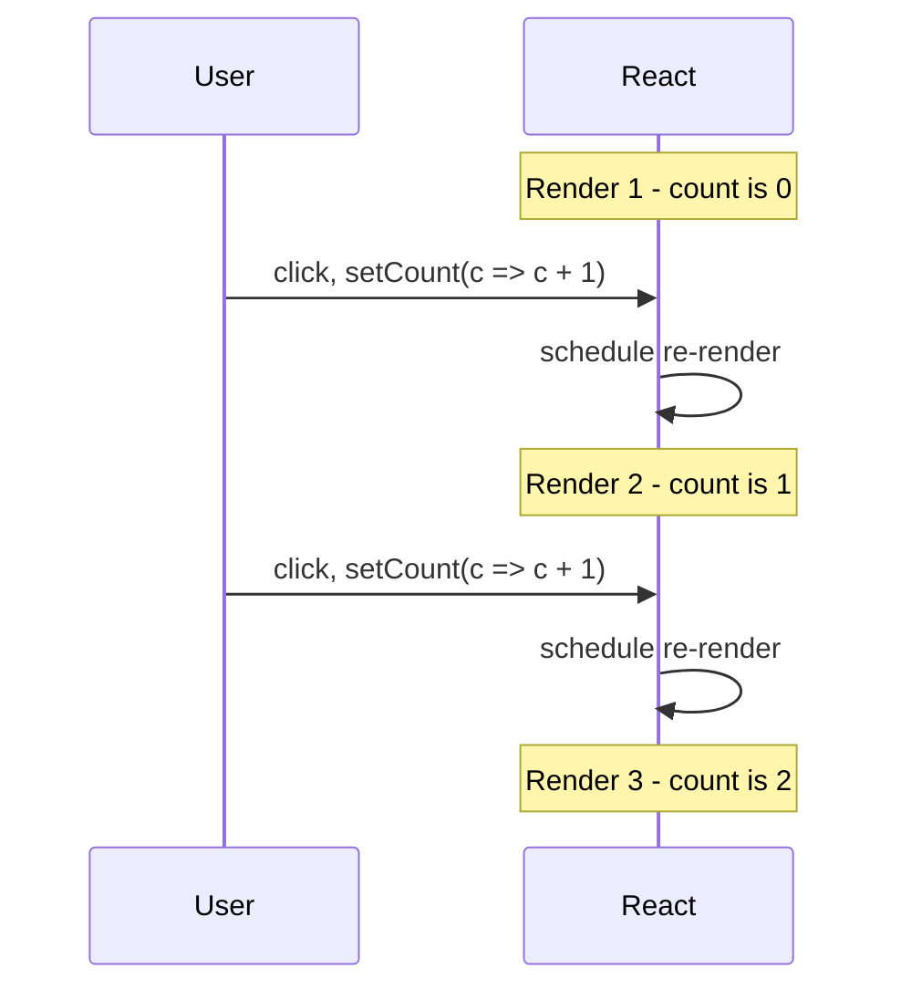

# 04 - The hooks mental model

## What a hook is

A **hook** is a function whose name starts with `use` that lets a *function
component* tap into React features: state (`useState`), side effects
(`useEffect`), context (`useContext`), and more. Before hooks (React 16.8,
2019), only class components could hold state. Hooks let plain functions do
everything, which is why modern React is almost entirely function components.

The hooks you meet in Module 2:

| Hook | Gives a component | Activity |
| --- | --- | --- |
| `useState` | local state that triggers re-renders | m2a3 |
| `useEffect` | a way to run side effects after render | m2a4 |
| `useContext` | read a shared value without prop drilling | m2a6 |
| custom `useX` | your own reusable stateful logic | m2a6 |

## The most important idea: state is a snapshot

When a component renders, the values it reads (props, state) are a **snapshot**
frozen for *that* render. They do not change mid-render. A state setter does not
edit the current variable; it asks React to render *again* with a new value.

```jsx
const [count, setCount] = useState(0)

function handleClick() {
  setCount(count + 1)
  setCount(count + 1)   // count is still 0 in this snapshot; ends at 1, not 2
}
```

Both lines read the same snapshot (`count === 0`), so both set it to `1`. To
build on the latest value, use the **updater function** form, which receives the
pending value:

```jsx
setCount(c => c + 1)
setCount(c => c + 1)   // 0 -> 1 -> 2
```

This trips up everyone once. The cure is to stop thinking "the variable
changed" and start thinking "the next render gets a new snapshot".

### State is a snapshot, visualized

Each click does not edit the current value; it schedules the *next* render,
which gets a fresh snapshot:



## The rules of hooks

Hooks rely on being called in the **same order on every render**, because React
tracks them by call order, not by name. Two rules follow:

1. **Only call hooks at the top level.** Never inside an `if`, a loop, or a
   nested function. Calling a hook conditionally changes the order between
   renders and breaks React's bookkeeping.

   ```jsx
   if (loggedIn) { const [x, setX] = useState(0) }   // WRONG
   const [x, setX] = useState(0)                       // right: always called
   ```

2. **Only call hooks from React functions:** function components, or other
   hooks (custom hooks). Not from regular functions or event handlers.

A linter rule (`eslint-plugin-react-hooks`) enforces both; trust it.

## Why hooks must be reusable: custom hooks

Because a hook is just a function that calls other hooks, you can **extract
shared logic** into your own hook. Markup is reused with components
([03](03-jsx-and-the-component-model.md)); *behavior* is reused with custom
hooks.

```jsx
function useLocalStorage(key, initial) {
  const [value, setValue] = useState(() => {
    const saved = localStorage.getItem(key)
    return saved ? JSON.parse(saved) : initial
  })
  useEffect(() => { localStorage.setItem(key, JSON.stringify(value)) }, [key, value])
  return [value, setValue]
}
```

Any component can now `const [name, setName] = useLocalStorage('name', '')` and
get persistence for free. Custom hooks **share logic, not state**: two components
calling `useLocalStorage` each get their own independent state.

## Dependency arrays in one line

`useEffect`, `useMemo`, and `useCallback` take a **dependency array** that tells
React when to re-run. `[]` = once; `[a, b]` = whenever `a` or `b` changes;
omitted = every render. List every reactive value the effect uses, or you get
stale data.

## In one breath, for the exam

> Hooks are `use*` functions that give function components state, effects, and
> context. The core mental model: **state is a snapshot per render**, so setters
> schedule the next render rather than mutating the current value (use the
> updater form to chain). The **rules of hooks**: call them only at the top level
> and only from React functions, so React can track them by call order. Custom
> hooks reuse stateful *logic*.

## References

- React Documentation. *State as a Snapshot*. https://react.dev/learn/state-as-a-snapshot
- React Documentation. *Queueing a Series of State Updates*. https://react.dev/learn/queueing-a-series-of-state-updates
- React Documentation. *Rules of Hooks*. https://react.dev/reference/rules/rules-of-hooks
- React Documentation. *Reusing Logic with Custom Hooks*. https://react.dev/learn/reusing-logic-with-custom-hooks
