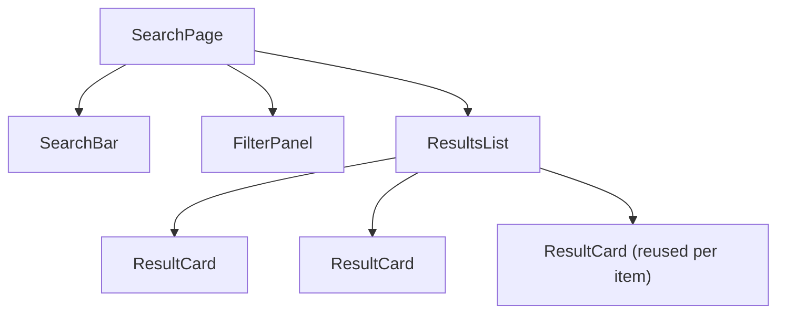
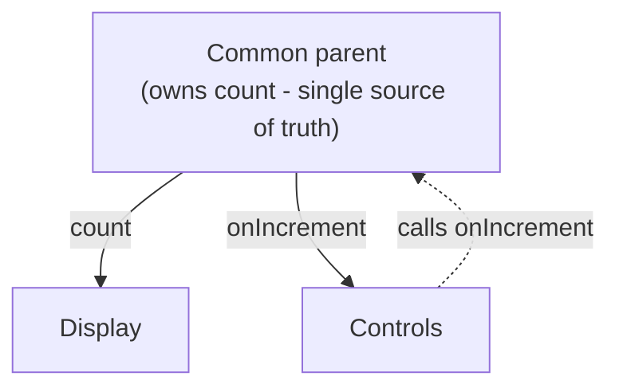

# 05 - Component architecture

This is the design skill that separates a beginner's React from a
professional's. The syntax is easy; deciding **what is a component, where state
lives, and how components talk** is the real work.

## How to split UI into components

Look at a mockup and draw boxes around the pieces. A good component does **one
thing**. Use the **single responsibility** heuristic: if you struggle to name a
component in a few words, or it is doing two unrelated jobs, split it.

```
SearchPage
├─ SearchBar          (input + button)
├─ FilterPanel        (a set of checkboxes)
└─ ResultsList
   └─ ResultCard      (one result, reused per item)
```

A component that appears many times with different data (`ResultCard`) is a
strong sign you found the right boundary.



## Presentational vs container (smart vs dumb)

A classic way to keep components clean is to separate two concerns:

- **Presentational ("dumb") components** care only about *how things look*. They
  receive data via props and render it. No state, no fetching. Easy to reuse and
  test. `ResultCard` is presentational.
- **Container ("smart") components** care about *how things work*. They hold
  state, fetch data, and pass it down to presentational components. `SearchPage`
  is a container.

```jsx
// container: owns the data
function SearchPage() {
  const [results, setResults] = useState([])
  // ...fetch, hold state...
  return <ResultsList results={results} />
}

// presentational: just renders what it is given
function ResultsList({ results }) {
  return <ul>{results.map(r => <ResultCard key={r.id} {...r} />)}</ul>
}
```

> This is a *guideline*, not a law. With hooks, the hard line has softened, and
> custom hooks now carry a lot of "smart" logic. But the instinct, **push state
> up and keep leaf components dumb**, still produces cleaner code.

## Data down, events up

From [03](03-jsx-and-the-component-model.md): data flows **down** as props,
changes flow **up** as callbacks. A child never reaches into a parent; the
parent hands the child a function to call.

```jsx
function Parent() {
  const [text, setText] = useState('')
  return <SearchBar value={text} onChange={setText} />   // down: value, up: onChange
}

function SearchBar({ value, onChange }) {
  return <input value={value} onChange={e => onChange(e.target.value)} />
}
```

The child does not own the state; it reports events. The parent decides what to
do. This keeps the single source of truth in one place.

## Lifting state up

When **two siblings need the same data**, neither should own it. Move the state
to their **closest common parent** and pass it down to both. This is *lifting
state up*, and it is the most common refactor in React.

```
        AppState (count)            <- state lives here
        /            \
   Display(count)   Controls(onIncrement)
```

Before: each sibling tries to keep its own copy and they drift apart. After: one
copy at the parent, both children read/affect it. There is now a **single source
of truth**.

When lifting makes the parent pass props through many layers that do not use
them ("prop drilling"), that is the signal to reach for **Context** or a state
library. See [06-state-management.md](06-state-management.md).

### Lifting state up, visualized



## Controlled components

A **controlled component** is one whose value is driven by React state (the
parent or itself), making React the single source of truth, versus an
**uncontrolled** one that holds its own value in the DOM. Controlled is the
default choice for forms because validation, disabling buttons, and resetting
all become simple reads of state. Covered hands-on in Activity 4.

## Thinking in React (the official 5 steps)

When you face a new screen:

1. **Break the UI into a component hierarchy** (draw the boxes).
2. **Build a static version** first: props only, no state. Just render the data.
3. **Find the minimal state.** What is the smallest set of changing data? Derive
   everything else; do not store what you can compute.
4. **Decide where each piece of state lives** (which common parent owns it).
5. **Add inverse data flow:** pass callbacks down so children can update it.

## In one breath, for the exam

> Split UI into single-responsibility components, separating **presentational**
> (how it looks, props only) from **container** (how it works, holds state).
> Data flows **down** as props and changes flow **up** as callbacks. When
> siblings share data, **lift state up** to their common parent so there is a
> single source of truth; when that causes prop drilling, switch to Context.

## References

- React Documentation. *Thinking in React*. https://react.dev/learn/thinking-in-react
- React Documentation. *Sharing State Between Components*. https://react.dev/learn/sharing-state-between-components
- React Documentation. *Choosing the State Structure*. https://react.dev/learn/choosing-the-state-structure
- Dan Abramov. *Presentational and Container Components*. https://medium.com/@dan_abramov/smart-and-dumb-components-7148f0021160
