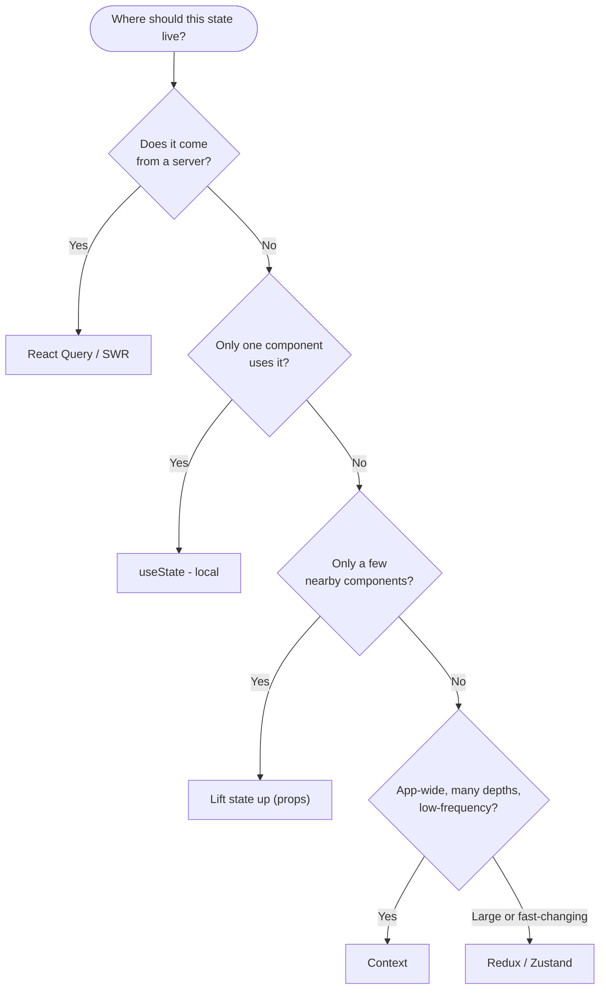

# 06 - State management

"State management" sounds like a big, separate topic. It is really one question
asked over and over: **where should this piece of data live?** Put it too low
and siblings cannot share it; put it too high and you drag it through layers
that do not care.

## The ladder: from local to global

Reach for the *simplest* option that works, and only climb when you must.

### 1. Local state (`useState`)

The data is used by **one component**. Keep it right there.

```jsx
const [isOpen, setIsOpen] = useState(false)   // a dropdown's open/closed
```

Most state is local. Do not over-engineer.

### 2. Lifted state (props)

**A few nearby components** share it. Lift it to their closest common parent and
pass it down ([05](05-component-architecture.md)). Still just `useState`, just
higher up.

### 3. Context (`useContext`)

The data is needed by **many components at different depths**, and threading
props through every level (prop drilling) has become painful. **Context** lets a
provider publish a value and any descendant read it directly.

```jsx
const AuthContext = createContext(null)

function App() {
  const [user, setUser] = useState(null)
  return (
    <AuthContext.Provider value={{ user, setUser }}>
      <Routes />          {/* any depth can read user */}
    </AuthContext.Provider>
  )
}

const { user } = useContext(AuthContext)   // in a deep child, no prop drilling
```

**Context is for low-frequency, app-wide values:** the current user, theme,
language, a cart. It is *not* a performance tool: every consumer re-renders when
the context value changes, so do not put fast-changing data in one big context.

> Context solves *prop drilling*, not *state management* in the heavy sense. It
> is a transport mechanism (how a value gets from A to B), and you still hold the
> value with `useState`/`useReducer`.

### 4. A state library

When global state gets **large, complex, or frequently updated** (a big
dashboard, an editor, lots of cross-cutting state), dedicated libraries earn
their keep:

| Library | Style | Good when |
| --- | --- | --- |
| **Redux (Toolkit)** | central store, actions, reducers | large apps, strict predictable updates, big teams |
| **Zustand** | tiny hook-based store | you want global state without the ceremony |
| **Jotai / Recoil** | atom-based | fine-grained, derived state |

You will not need these for Module 2; Context plus `useState` is plenty. Know
they exist and *why* (Context re-rendering and boilerplate at scale is what they
address).

### Server state is its own thing

Data that lives on a server (fetched over the network) is **not** the same as UI
state: it can be stale, needs caching, refetching, and loading/error states.
Libraries like **TanStack Query (React Query)** or **SWR** specialize in it.
Mixing server data into your UI-state store by hand is a common source of bugs.

## `useState` vs `useReducer`

When one piece of state has **many related transitions** (a form with several
fields and validation, a wizard with steps), `useReducer` centralizes the update
logic into one reducer function, the same pattern Redux scaled up:

```jsx
const [state, dispatch] = useReducer(reducer, initialState)
dispatch({ type: 'increment' })
```

Use `useState` for simple values; reach for `useReducer` when the update logic
gets tangled.

## A decision guide




```
Is the data used by only one component?         -> useState (local)
A few nearby components?                          -> lift state up (props)
Many components, deep tree, app-wide?             -> Context
Large/complex/fast global state?                  -> Redux / Zustand
Data that comes from a server?                    -> React Query / SWR
```

## In one breath, for the exam

> State management is deciding **where data lives**. Climb the ladder only as
> needed: **local** `useState`, then **lifted** state via props, then
> **Context** to avoid prop drilling for app-wide values, then a library
> (Redux/Zustand) for large or fast-changing global state. **Server data** is its
> own category, handled by tools like React Query. Context transports a value; it
> does not replace holding it with `useState`/`useReducer`.

## References

- React Documentation. *Managing State*. https://react.dev/learn/managing-state
- React Documentation. *Scaling Up with Reducer and Context*. https://react.dev/learn/scaling-up-with-reducer-and-context
- React Documentation. *Passing Data Deeply with Context*. https://react.dev/learn/passing-data-deeply-with-context
- Redux Toolkit. *Getting Started*. https://redux-toolkit.js.org/introduction/getting-started
- TanStack Query. *Overview*. https://tanstack.com/query/latest/docs/framework/react/overview
