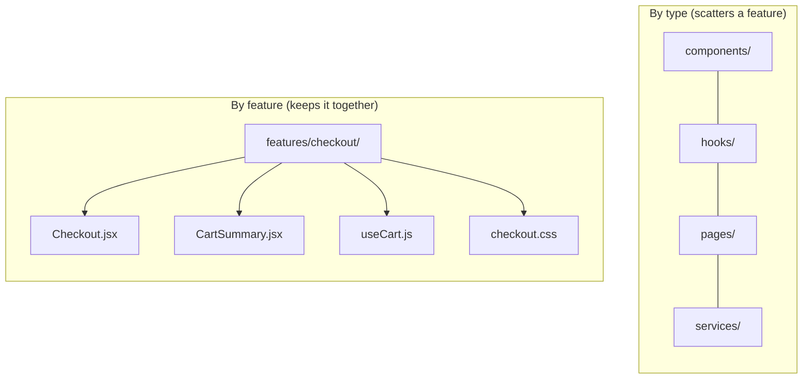

# 07 - Project structure and organization

React is famously **unopinionated** about file structure. It will not tell you
where to put anything. That freedom is a trap for beginners, who end up with one
giant `components/` folder of 80 files. This doc is the structure half of "clean
React"; [08-atomic-design.md](08-atomic-design.md) is the design-vocabulary half.

## Two ways to organize: by type vs by feature

**By type** groups files by *what they are*:

```
src/
├─ components/
├─ hooks/
├─ pages/
├─ utils/
└─ services/
```

Fine for a small app. It breaks down as the app grows: working on the
"checkout" feature means jumping between five folders, and nothing tells you
which files belong together.

**By feature** groups files by *what they are about*:

```
src/
├─ features/
│  ├─ checkout/
│  │  ├─ Checkout.jsx
│  │  ├─ CartSummary.jsx
│  │  ├─ useCart.js
│  │  └─ checkout.css
│  └─ products/
│     ├─ ProductList.jsx
│     ├─ ProductCard.jsx
│     └─ useProducts.js
├─ components/        (truly shared, generic UI: Button, Modal)
├─ hooks/             (truly shared hooks)
└─ lib/               (api client, helpers)
```

Everything for a feature sits together, so it is easy to find, change, and even
delete as a unit. **Rule of thumb: start by type for a tiny app, move to feature
folders the moment a feature spans more than a couple of files.**



## Colocation

The guiding principle behind feature folders is **colocation: keep things that
change together, close together.** A component's test, styles, and helper hook
belong next to it, not scattered across the tree. When you delete the feature,
everything goes with it and nothing is orphaned.

```
ProductCard/
├─ ProductCard.jsx
├─ ProductCard.test.jsx
└─ ProductCard.module.css
```

## Naming conventions

Consistency matters more than the exact choice, but the common conventions are:

- **Components:** `PascalCase` files and names (`ProductCard.jsx`). The capital
  is also how JSX knows it is a component.
- **Hooks:** `camelCase` starting with `use` (`useProducts.js`).
- **Everything else** (utils, constants): `camelCase`.
- **One component per file**, named the same as the file. The file *is* the
  component.
- **Folders** for the feature, lowercase (`checkout/`, `products/`).

## Barrel files (index.js)

A **barrel** is an `index.js` that re-exports a folder's public pieces, so
importers do not reach into internals:

```js
// features/products/index.js
export { ProductList } from './ProductList'
export { ProductCard } from './ProductCard'
```

```js
import { ProductList, ProductCard } from '@/features/products'   // clean
```

Barrels define a folder's **public API** and tidy imports. The caution: large
barrels can hurt bundler tree-shaking and cause circular imports, so do not
barrel everything. Use them for a feature's intended public surface.

## Other conventions you will see

- **`assets/`** for images and fonts; **`styles/`** for global CSS.
- **Path aliases** (`@/features/...` instead of `../../../`) configured in Vite,
  to kill brittle relative paths.
- **`pages/` or `routes/`** for top-level route components when using a router
  ([Activity 5](../m2-react/README.md)).
- A **`components/ui/`** folder for the generic design-system primitives (the
  "atoms" of [08-atomic-design.md](08-atomic-design.md)).

## In one breath, for the exam

> React does not dictate structure, so you impose one. Organize **by feature**
> rather than by type as an app grows, following **colocation** (files that
> change together live together). Use consistent naming (`PascalCase`
> components, `use*` hooks), one component per file, and **barrel** `index.js`
> files to expose a feature's public API and clean up imports.

## References

- React Documentation (legacy). *File Structure*. https://legacy.reactjs.org/docs/faq-structure.html
- Kent C. Dodds. *Colocation*. https://kentcdodds.com/blog/colocation
- Robin Wieruch. *React Folder Structure in 5 Steps*. https://www.robinwieruch.de/react-folder-structure/
- Vite. *Features* (assets and path aliases). https://vite.dev/guide/features.html
