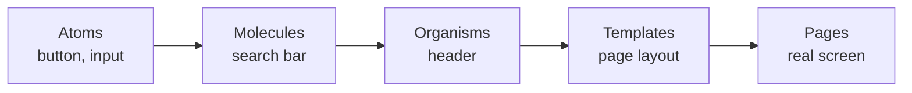
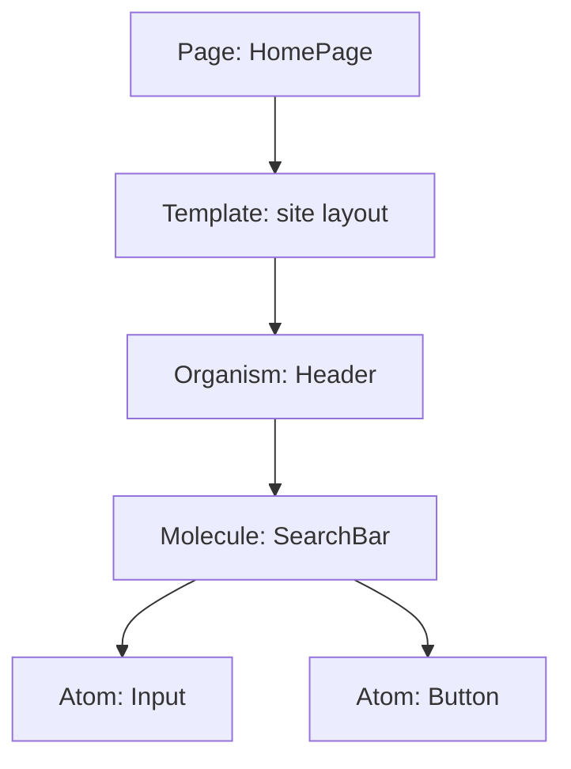

# 08 - Atomic design

## The idea

**Atomic design** is a methodology by Brad Frost for building interfaces out of
a clear hierarchy of reusable pieces, borrowing a metaphor from chemistry. You
start from the smallest building blocks and combine them into bigger and bigger
structures. It maps almost perfectly onto React's component tree, which is why
it is the most-cited mental model for organizing UI components.

## The five levels

```
Atoms  ->  Molecules  ->  Organisms  ->  Templates  ->  Pages
 small ──────────────────────────────────────────────► whole screen
```



### 1. Atoms

The smallest useful UI elements, indivisible without losing meaning: a button, an
input, a label, an icon, a heading. They have no business logic; they just look
and behave like that one thing. In React these are your generic primitives.

```jsx
<Button />   <Input />   <Label />   <Avatar />
```

### 2. Molecules

A small group of atoms working together as a unit. A search field is a `Label` +
`Input` + `Button` combined into one reusable `SearchBar`.

```jsx
function SearchBar() {
  return (
    <form>
      <Label htmlFor="q">Search</Label>
      <Input id="q" />
      <Button>Go</Button>
    </form>
  )
}
```

### 3. Organisms

A larger, distinct section of an interface made of molecules and atoms: a site
**header** (logo + nav + `SearchBar`), a **product grid**, a **comment thread**.
Organisms are recognizable chunks of a page.

### 4. Templates

A page-level **layout** that arranges organisms into a structure, using
**placeholder** content. A template defines *where things go* (header here, sidebar
there, content in the middle) without real data. In React this is your layout
component ([Activity 6](../m2-react/README.md)).

### 5. Pages

A template filled with **real data**: the actual Home page, the actual Product
page. Pages are what the user sees, and where you test whether the design holds
up with genuine content.

### One page, broken into levels



## How it maps to React and to folders

Atomic design gives you a **vocabulary and a folder scheme** at the same time:

```
src/components/
├─ atoms/        Button, Input, Icon, Label
├─ molecules/    SearchBar, FormField, Card
├─ organisms/    Header, ProductGrid, Footer
├─ templates/    DashboardLayout, MarketingLayout
└─ pages/        HomePage, ProductPage
```

Every React component is just a function returning UI; atomic design tells you
*which layer* a given component belongs to and what it may depend on. The key
rule: **a level may use the levels below it, never above.** An atom never imports
an organism.

## Why it is useful

- **Reuse.** Build an atom once, use it everywhere. Consistency comes for free.
- **A shared language.** "That belongs in molecules" is a precise instruction a
  whole team understands.
- **It pairs with design systems.** The atoms and molecules *are* your design
  system's component library ([09-design-systems.md](09-design-systems.md)).

## Honest caveats

- The boundaries are **fuzzy**. Is a card a molecule or an organism? Teams argue
  about this. Do not let the taxonomy become bureaucracy; it is a guide, not a
  rulebook.
- Many teams use a **lighter version**: just `ui/` (atoms + molecules) and
  `features/` (organisms + pages), which blends atomic design with the
  feature-folder structure of [07](07-project-structure-and-organization.md).

## In one breath, for the exam

> Atomic design (Brad Frost) organizes UI into five levels: **atoms** (buttons,
> inputs), **molecules** (small groups of atoms like a search bar), **organisms**
> (page sections like a header), **templates** (layouts with placeholder
> content), and **pages** (templates with real data). It maps directly onto
> React's component tree and gives a team a shared vocabulary and folder
> structure, where a level may use the levels below it but never above.

## References

- Brad Frost. *Atomic Design Methodology* (Chapter 2). https://atomicdesign.bradfrost.com/chapter-2/
- Brad Frost. *Atomic Design* (full book online). https://atomicdesign.bradfrost.com/
- React Documentation. *Thinking in React* (breaking UI into a hierarchy). https://react.dev/learn/thinking-in-react
