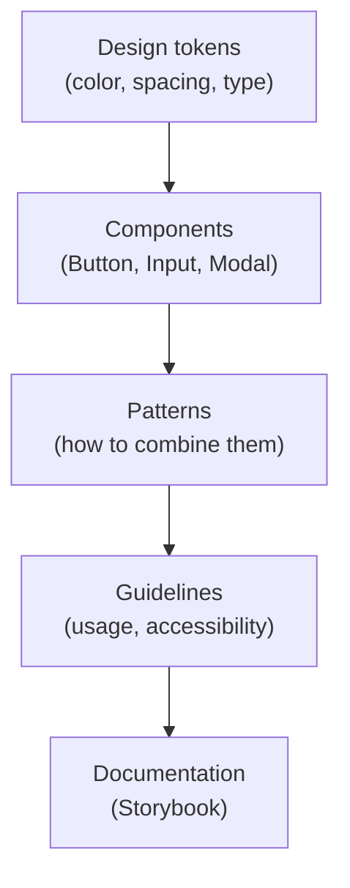

# 09 - Design systems

## What a design system is

A **design system** is the single source of truth for how a product looks and
behaves: the reusable components, the visual rules (color, type, spacing), and
the guidelines for using them, all kept in one place so every screen feels like
the same product. It is bigger than a component library and bigger than a style
guide; it is both, plus the principles that tie them together.

Think of it as the difference between **handing each developer a box of LEGO with
a manual** versus letting everyone whittle their own bricks. The system makes the
fiftieth screen as consistent as the first.

## What is inside one

| Layer | What it is | Example |
| --- | --- | --- |
| **Design tokens** | named design decisions as data | `color-primary: #2563eb`, `space-4: 16px` |
| **Components** | the reusable building blocks | `Button`, `Input`, `Modal` (your atoms/molecules) |
| **Patterns** | recommended ways to combine them | how a form should be laid out |
| **Guidelines** | usage rules, do's and don'ts, a11y notes | "primary buttons: one per view" |
| **Documentation** | where all of it is written down | a Storybook site |

### The layers of a design system



## Design tokens: the foundation

**Design tokens** are the smallest pieces: named, reusable values for color,
spacing, font size, radius, shadow. Instead of hard-coding `#2563eb` in 200
places, you define it once as a token and reference the name.

```css
:root {
  --color-primary: #2563eb;
  --space-4: 1rem;
  --radius-md: 8px;
}
.button { background: var(--color-primary); padding: var(--space-4); }
```

Change the token, and every component that uses it updates at once. Tokens are
how a design system supports **theming** (light/dark) and **rebrands** without
touching component code. In React they are commonly delivered as CSS custom
properties or a theme object passed through Context.

## Component libraries: building vs adopting

The component layer of a design system is a **component library**. You have two
choices:

- **Adopt an existing one.** Material UI (MUI), Ant Design, Chakra UI, or
  unstyled primitives like Radix/shadcn give you a ready, accessible,
  battle-tested set. Fastest path; you inherit their look and constraints.
- **Build your own.** Full control and a unique brand, but you own accessibility,
  testing, and maintenance forever. Usually only worth it at scale.

Many teams sit in between: unstyled accessible primitives (Radix) styled with
their own tokens.

## Storybook: documenting components

**Storybook** is the standard tool for developing and documenting components in
**isolation**. Each component gets "stories" showing its variants (a `Button` in
primary, disabled, loading states) on a page of its own, separate from the app.
It becomes the living catalog of the design system and a place to test edge
cases without clicking through the whole app.

## Why it matters

- **Consistency** across screens, teams, and time. The product feels coherent.
- **Speed.** Reach for an existing `Button` instead of restyling one each time.
- **Accessibility once, everywhere.** Get it right in the component, inherit it
  everywhere it is used.
- **A shared language** between designers and developers: they talk about the
  same `Button` variant, often literally synced from Figma to code via tokens.

## How it connects to the rest of this library

- The components in a design system are the **atoms and molecules** of
  [08-atomic-design.md](08-atomic-design.md).
- They live in your `components/ui/` folder from
  [07-project-structure-and-organization.md](07-project-structure-and-organization.md).
- Tokens are often distributed through React **Context** as a theme
  ([06-state-management.md](06-state-management.md)).

## In one breath, for the exam

> A design system is the single source of truth for a product's UI: **design
> tokens** (named values for color, spacing, type), a **component library** (the
> reusable building blocks), plus patterns, guidelines, and documentation (often
> in **Storybook**). It delivers consistency, speed, built-in accessibility, and a
> shared language for designers and developers. Teams either adopt one (MUI,
> Chakra, Radix) or build their own.

## References

- Nielsen Norman Group. *Design Systems 101*. https://www.nngroup.com/articles/design-systems-101/
- Design Tokens Community Group (W3C). https://www.designtokens.org/
- Storybook. *Documentation*. https://storybook.js.org/docs
- Material Design 3. https://m3.material.io/
- MDN Web Docs. *Using CSS custom properties (variables)*. https://developer.mozilla.org/en-US/docs/Web/CSS/Using_CSS_custom_properties
