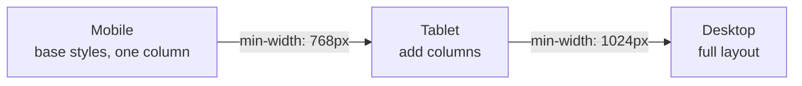

# 10 - Design methodologies

This doc steps back from React to the **web design principles** every front-end
developer is expected to know. React is how you build the UI; these are how you
decide whether the UI is any *good*. Bring these to your project critique.

## Responsive design

A **responsive** site adapts its layout to any screen size, from a phone to a
wide monitor, instead of shipping a fixed-width page. The tools:

- **Fluid layouts** using relative units (`%`, `rem`, `vw`) and modern CSS
  layout (Flexbox, Grid) rather than fixed pixels.
- **Media queries** that change styles at **breakpoints**:

  ```css
  .grid { grid-template-columns: 1fr; }              /* phone: one column */
  @media (min-width: 768px) {
    .grid { grid-template-columns: 1fr 1fr 1fr; }    /* tablet+: three */
  }
  ```

- **Flexible images** (`max-width: 100%`) so media never overflows.

## Mobile-first

**Mobile-first** is a methodology, not just a screen size: design the smallest
screen *first*, then progressively add for larger ones. You write the base
styles for mobile and use `min-width` media queries to *add* complexity upward.

Why start small? It forces you to prioritize the essential content and actions
(a phone has no room for clutter), and adding is easier than taking away. It also
matches how most users actually arrive: on a phone.

### Mobile-first, visualized

Write the base styles for the smallest screen, then *add* with `min-width`
breakpoints as the screen grows:



## Accessibility (a11y)

**Accessibility** means people with disabilities can use your site: screen-reader
users, keyboard-only users, people with low vision or color blindness. It is both
an ethical baseline and, in many places, a legal one. The essentials:

- **Semantic HTML.** Use `<button>`, `<nav>`, `<main>`, `<h1>`...`<h6>` for their
  meaning. A `<div onClick>` is invisible to assistive tech; a `<button>` is
  focusable and announced for free. In JSX this is `className`, but the element
  choice still matters.
- **Alt text** on meaningful images; empty `alt=""` on decorative ones.
- **Labels** tied to inputs (`htmlFor`/`id`), so forms are usable.
- **Keyboard access.** Every interactive thing must work without a mouse, with a
  visible focus outline.
- **Color contrast.** Text must contrast enough with its background (WCAG AA is
  the common target). Never use color as the *only* signal.

> React tip: prefer real elements over click-handlers on `<div>`s, and use the
> `eslint-plugin-jsx-a11y` linter to catch the obvious misses.

## UX heuristics

**Nielsen's 10 usability heuristics** are the classic checklist for judging an
interface. A few you will use most:

- **Visibility of system status.** Always show what is happening: loading
  spinners, success messages, disabled buttons while submitting.
- **Match the real world.** Use the user's words, not internal jargon.
- **User control and freedom.** Offer undo, cancel, and a clear way back.
- **Consistency and standards.** A button looks like a button everywhere (this is
  what a design system enforces, [09](09-design-systems.md)).
- **Error prevention and recovery.** Stop mistakes before they happen; when they
  do, explain them in plain language and say how to fix them. (Form validation in
  Activity 4 is exactly this.)
- **Recognition over recall.** Show options; do not make users remember them.

## Visual design basics

A small amount of visual theory goes a long way:

- **Hierarchy.** Size, weight, and color guide the eye to what matters first.
- **Whitespace.** Space is not wasted; it groups related things and reduces
  clutter.
- **Alignment and a grid.** Things lined up to a consistent grid look
  intentional.
- **Contrast.** Important things should stand out; similar things should look
  similar.
- **Typography.** Limit fonts, keep line length readable (around 50 to 75
  characters), set comfortable line height.

These are the same levers the Artifact/design guidance calls "information
hierarchy": design exists to make the important things unmissable.

## Progressive enhancement vs graceful degradation

- **Progressive enhancement:** start with a baseline that works for everyone,
  then layer on enhancements for capable browsers.
- **Graceful degradation:** build the full experience, then ensure it still
  *functions* (less prettily) where features are missing.

Both aim at the same goal: the core task works for the widest possible audience.

## In one breath, for the exam

> Front-end design rests on **responsive** layouts (fluid units, media queries,
> breakpoints) built **mobile-first**, **accessibility** (semantic HTML, labels,
> keyboard access, color contrast), and usability heuristics (visible system
> status, consistency, error prevention/recovery). Visual design is about
> **hierarchy, whitespace, alignment, contrast, and typography** to make the
> important things unmissable.

## References

- MDN Web Docs. *Responsive design*. https://developer.mozilla.org/en-US/docs/Learn_web_development/Core/CSS_layout/Responsive_Design
- MDN Web Docs. *Accessibility*. https://developer.mozilla.org/en-US/docs/Learn_web_development/Core/Accessibility
- W3C. *WCAG 2 at a Glance*. https://www.w3.org/WAI/standards-guidelines/wcag/glance/
- Nielsen Norman Group. *10 Usability Heuristics for User Interface Design*. https://www.nngroup.com/articles/ten-usability-heuristics/
- Luke Wroblewski. *Mobile First*. https://www.lukew.com/ff/entry.asp?933
