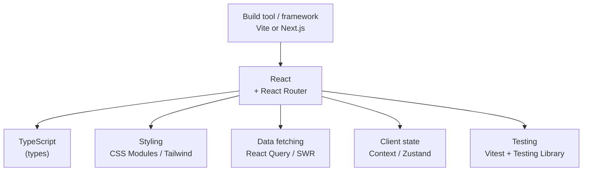

# 11 - The React ecosystem

React is a **library**, not a framework ([01](01-what-is-react.md)), so a real
app is React *plus* a set of tools you choose. This doc is the map of that
landscape, so the names you hear in tutorials and job posts stop being a blur.

## Build tools: how the app is created and served

Your code (JSX, modules, multiple files) is not something a browser runs
directly. A **build tool** bundles and transforms it, and serves it during
development.

| Tool | Status | Notes |
| --- | --- | --- |
| **Vite** | the modern default | instant dev server, fast builds. Use this. |
| **Create React App (CRA)** | **deprecated** | the old default; no longer maintained. You will see it in old tutorials. |
| **Next.js** | framework | React plus routing, server rendering, and more (see below). |

Vite is what Module 2 uses: `npm create vite@latest`.

## Frameworks built on React

When you want the "batteries included" experience React itself withholds, you
reach for a **meta-framework**:

- **Next.js** is the big one: file-based routing, **server-side rendering (SSR)**
  and **static generation (SSG)** for speed and SEO, API routes, and image
  optimization. Much of the modern "React" job market is really Next.js.
- **Remix** (now merged into React Router) and **Astro** are other options, each
  with a different take on server rendering.

You do not need these for Module 2; know that "React app" in industry often means
"Next.js app".

## Routing

React has no built-in router. The standard is **React Router** (Activity 5).
Next.js has its **own** file-based router instead. Either way, routing is a
*choice you add*, not a part of React.

## Styling: the many options

There is no one official way to style React. The main families:

| Approach | What it looks like | Trade-off |
| --- | --- | --- |
| **Plain CSS / CSS files** | import a `.css` file | simple; global scope can clash |
| **CSS Modules** | `styles.module.css`, locally scoped | no name clashes, still just CSS |
| **Tailwind CSS** | utility classes in JSX (`className="p-4 flex"`) | fast, consistent; verbose markup |
| **CSS-in-JS** (styled-components, Emotion) | styles written in JS | dynamic styling; runtime cost |
| **Component libraries** | MUI, Chakra, Ant | styled components out of the box ([09](09-design-systems.md)) |

For learning, plain CSS or CSS Modules is perfect. Tailwind is extremely common
in industry now.

## Data fetching

React can fetch data with `fetch` inside an effect (Activity 4), but real apps
use a **server-state library** for caching, refetching, and loading/error
handling ([06](06-state-management.md)):

- **TanStack Query (React Query)** and **SWR** are the standards.

## Testing

| Tool | For |
| --- | --- |
| **Vitest / Jest** | the test runner (Vitest is the modern, Vite-native one) |
| **React Testing Library** | rendering components and asserting on what the user sees |
| **Playwright / Cypress** | end-to-end tests driving a real browser |

**Vitest + React Testing Library** is the recommended way to test components:
assert on visible text and behavior, not implementation details.

## TypeScript

**TypeScript** is JavaScript with types. Most professional React is written in
TypeScript (`.tsx` files) because types catch a whole class of bugs (a typo in a
prop name, the wrong shape of data) before the app even runs. You will see
`.tsx` everywhere in industry. Module 2 stays in JavaScript so you focus on React
itself, but knowing TS is the natural next step.

### The pieces around React



## A rough "modern stack" you will recognize

```
Vite (or Next.js)        build tool / framework
React + React Router     UI + routing
TypeScript               types
Tailwind (or CSS Modules)styling
TanStack Query           server data
Zustand / Context        client state
Vitest + Testing Library testing
```

No two teams pick exactly the same set; that *is* the React ecosystem. The skill
is knowing what each slot does so you can read any stack.

## In one breath, for the exam

> Because React is a library, an app is React plus chosen tools: a **build tool**
> (Vite, replacing the deprecated CRA) or a **framework** (Next.js, adding
> routing + server rendering), a **router** (React Router), a **styling** approach
> (CSS Modules, Tailwind, CSS-in-JS, or a component library), **data fetching**
> (React Query/SWR), **testing** (Vitest + React Testing Library), and usually
> **TypeScript**.

## References

- React Documentation. *Creating a React App*. https://react.dev/learn/creating-a-react-app
- Vite. https://vite.dev/
- Next.js. *Documentation*. https://nextjs.org/docs
- React Router. https://reactrouter.com/
- React Testing Library. *Introduction*. https://testing-library.com/docs/react-testing-library/intro/
- TanStack Query. https://tanstack.com/query/latest
- TypeScript. *Documentation*. https://www.typescriptlang.org/docs/
