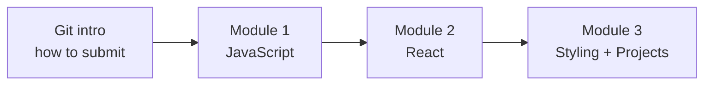

# Start Here

Welcome. This course takes you from JavaScript basics to building and styling
real React apps, one small step at a time. You do not need to know any of this
yet, and you are not expected to memorize anything. Read a little, build a
little, repeat.

This page is your map. Skim it once, then come back whenever you are unsure
where something lives or what to do next.

## The path

| Step | You learn | You build |
| --- | --- | --- |
| **Git intro** | how Git and GitHub work | nothing yet, just setup |
| **Module 1** | the JavaScript React needs | small functions, one per idea |
| **Module 2** | React: components, state, routing, hooks | small components, guided step by step |
| **Module 3** | styling, responsive design, UI libraries | two projects you choose the look of |

Each module builds on the one before it. Go in order. It is normal for React
(Module 2) to feel slower than the JavaScript module at first; that is expected,
not a sign you are behind.

## Two kinds of repository (this trips people up, so read it)

You will work with **two different kinds of GitHub repo**:

1. **Your workspace repo** (named `student-6apsi-...`) is your home base. It
   holds the **course reading** (the `content/` folder, where this page lives)
   and your grade receipts. You **read** here; you do not write code here.
2. **Activity and project repos** (named `m1a1-...`, `m2a1-...`, `m3a1-...`)
   are one per activity. You create each from a **template**, then **write your
   code** there and push to submit.

So: **reading lives in your workspace repo; code lives in each activity repo.**
When an activity says "see `content/m2-react`", that reading is in your
workspace repo.

## How every activity works (the loop)

The same five steps every time:

1. **Create your copy** of the activity from its template
   (*Use this template -> Create a new repository*), owned by the **`HAU-6APSI`**
   org, set to **Private**, named like `m2a1-<classcode>-yourname`.
2. **Clone it** to your computer and run `npm install` once.
3. **Write your code** in the `src/` folder, following the `// TODO` notes (in
   Modules 1 and 2) or the project brief (in Module 3).
4. **Run the tests** with `npm test`. Each passing test is a point. Run
   `npm run test:watch` to have them re-run as you save.
5. **Push** (`git add -A`, `git commit`, `git push`). Pushing **is** submitting.
   Then open the repo's **Actions** tab to see your result.

Fill in `student.json` (your name and details) in every activity; keep it the
same across all of them.

## How you are graded

- In **Modules 1 and 2**, your grade is simply how many tests pass. Green is the
  goal. The tests tell you exactly what each piece should do.
- In **Module 3**, the projects are graded in two parts: automated checks (it
  builds, it runs, the required features work, it is responsive) plus a rubric
  your instructor scores for design and code quality. See
  `content/m3-styling/ASSESSMENT.md`.

You can always run the same checks yourself with `npm test` before you push.
There are no surprises.

## What to read, and when

You do **not** need to read everything before you start. Read just enough to
begin, then come back when you get stuck.

- **Module 1:** read `content/m1-jsfundamentals` alongside the activities.
- **Module 2:** read `content/m2-react` (it maps each activity to exactly what
  you need). The deeper `content/react-theory` library is **reference**: dip into
  a page when an activity points you to it. If you want a head start, read just
  `react-theory/01` (what React is), `02` (the Virtual DOM), and `03` (JSX and
  components).
- **Module 3:** read `content/m3-styling` (start with `01`, then the doc for the
  styling approach you choose), and each project's brief.

## When you get stuck

- Re-read the one section the activity points to. Usually that is enough.
- Run `npm run test:watch` and work one failing test at a time.
- Look at the example in the reading; it shows the *same idea* on a different
  problem, so you still get to solve yours.
- Stuck on a React idea? Go back to the Module 2 reading. Stuck on layout? See
  `content/m3-styling/05`.

## Ready?

Start with **`content/git-intro`** to set up Git, then open
**`content/m1-jsfundamentals`** and create your first activity. Take your time.
